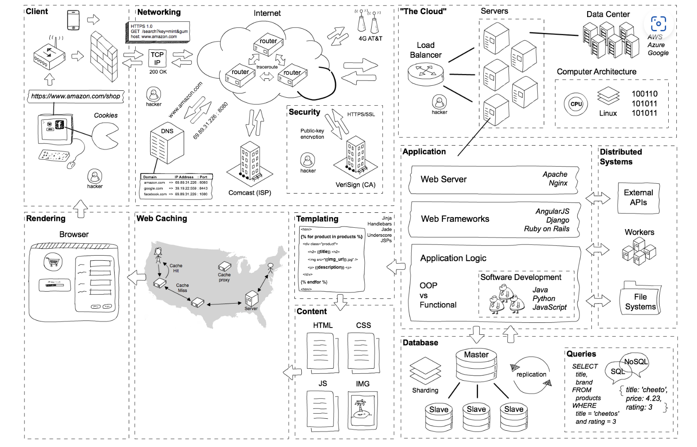

## 輸入網址和域名解析
- 當你在瀏覽器中輸入一個網址（例如 `www.example.com`），瀏覽器首先會進行域名解析，將域名轉換成對應的 IP 地址。
- 網址包含「通訊協定（Protocol）」、「網域（Domain）」、「路徑（Path）」等資訊
- 在現代瀏覽器中，如果輸入的內容看似未包含協定前綴、網域或 IP，瀏覽器可能將其視為搜尋字詞，而非不合法的 URL。若內容不完整但能被自動修正，瀏覽器可能自動補全（如自動加上 "https://" 或 ".com" 等）。
- 瀏覽器會查詢 DNS (Domain Name System) 伺服器，以獲取域名對應的 IP 地址。
- DNS 是用來儲存網域對應到的 IP 位址的服務。

## 建立網路連線
- 瀏覽器獲得伺服器的 IP 地址後，會使用 TCP 建立網路連線。
- TCP 使用一個被稱為 "三次握手" 的過程來建立一個連線。在這個過程中，兩個通訊方互相交換信息，確認連線的有效性。具體過程如下：
  1. 用戶端發送一個包含 SYN（Synchronize）標誌的封包，表示希望與伺服器建立連線。
  2. 伺服器接收這個封包後，回應一個包含 SYN 和 ACK（Acknowledge）標誌的封包，表達同意建立連線。
  3. 用戶端再回應一個包含 ACK 標誌的封包，確認連線已經建立。
- 資料傳輸：連接建立後，雙方可以開始傳輸資料。TCP 通過順序號、確認號和重發機制來確保資料的可靠傳輸。
- 如果網址是 HTTPS 協議，還需要建立 TLS（傳輸層安全協議）加密連接，以確保通訊的安全性。

## 發送 HTTP 請求
- 瀏覽器主要是辨識 URI 中的協定部分，如 HTTP 或 HTTPS。這決定了瀏覽器如何與伺服器通訊。
- 若 URI 中沒有指定協定，瀏覽器會預設使用 HTTP。
- 連接建立後，瀏覽器向伺服器發送 HTTP 請求，通常是 GET 請求。
- HTTP 請求包含標頭、查詢參數(用 "?" 表示，附加在 URL 末尾)、Cookie 和其他必要信息。
- 標頭包含有關請求的信息，包括：
  1. Content-Type：說明請求或響應的內容類型，例如 "application/json"、"text/html"、"multipart/form-data" 等。
  2. User-Agent：描述用戶端應用程式，例如瀏覽器版本。
  3. Authorization：攜帶認證信息，例如 "Bearer token"。
  4. Accept：表示用戶端希望接收的資料類型，例如 "application/json"。
  5. Host：指定目標主機的域名。
  6. 其他常用標頭：如 "Content-Length"、"Cookie"、"Referer" 等。

## 伺服器處理請求
- 伺服器接收到 HTTP 請求後，會根據請求內容進行處理，例如查找資源、執行後端代碼、查詢資料庫等。
- 一旦處理完畢，伺服器會生成 HTTP 回應，通常包括狀態代碼、回應標頭和可能的回應體（例如 HTML 文件）。

## 接收和處理 HTTP 回應
- 瀏覽器接收到 HTTP 回應後，檢查狀態代碼、標頭和正文。
- 狀態碼：例如 200 (成功)，404 (未找到)，500 (內部伺服器錯誤) 等。
- 響應標頭：提供與響應相關的元資料。
- 響應正文：包含請求的實際內容，例如網頁、JSON 資料等。
- 如果回應有效，瀏覽器將進行進一步的處理。若需要其他資源，如 CSS、JavaScript 或圖片，可能會發送額外的請求。

## 解析和渲染網頁
- 瀏覽器開始解析 HTML 文件，構建 DOM（文檔對象模型）。
### 解析HTML DOM
- 瀏覽器將收到的 HTML 文檔轉換為一個結構化的樹狀模型，稱為 DOM（Document Object Model）。
- DOM 代表網頁的結構和內容，每個 HTML 標籤被解析為一個節點。
- 解析順序：瀏覽器按順序從上到下解析 HTML 標籤。這個過程包括識別標籤的名稱、屬性和嵌套關係。
### 解析 CSS
- CSS 規則：瀏覽器提取 CSS 文件或內嵌在 HTML 中的 CSS 規則，這些規則定義了網頁的樣式，包括布局、顏色、字體等。
- CSSOM（CSS Object Model）：瀏覽器將 CSS 規則轉換為一個樹狀結構，以便與 DOM 進行交互。CSSOM 與 DOM 結合，用於計算元素的最終樣式。
### 構建 Render Tree
- 結合 DOM 和 CSSOM：瀏覽器將 DOM 和 CSSOM 結合，生成一個 Render Tree。這個樹只包含可視元素（例如，隱藏的元素不在 Render Tree 中），並且結合了樣式信息。
- 計算布局：瀏覽器計算每個元素在網頁上的位置和尺寸，這個過程稱為布局（layout）。
### 繪製和渲染
- 繪製（Painting）：瀏覽器將 Render Tree 中的每個元素轉換為繪製指令，並將這些指令發送到瀏覽器的渲染引擎。繪製過程包括填充顏色、繪製文本、圖片等。
- 渲染（Rendering）：渲染引擎將繪製的結果輸出到螢幕上，最終渲染網頁。
### 處理 JavaScript
- 在網頁渲染後，瀏覽器會執行 JavaScript 代碼。
- 解析和執行 JavaScript：如果網頁包含 JavaScript，瀏覽器將解析和執行這些腳本。這可能會影響 DOM 和 CSSOM，導致重新構建 Render Tree。
- 事件處理：JavaScript 可以處理用戶交互（如點擊、滑動等），並更新網頁內容。
### 重繪和重布局
重繪（Repaint）：如果樣式發生改變，可能會導致重繪。
重布局（Reflow）：如果元素的位置或尺寸改變，可能需要重新計算布局並進行重繪。

## 維護和持續更新
- 當網頁顯示後，瀏覽器持續處理用戶交互。
- 此外，瀏覽器可能會使用 AJAX 或 WebSocket 與伺服器持續通訊，確保網頁內容動態更新。

## 註記
### cache
- 在實際向 DNS 發出請求之前，瀏覽器會依序檢查以下 cache，如果找不到就會往下一層 cache 找：
瀏覽器 cache > OS cache > Router cache > ISP cache
- 如果這些 cache 中沒有該網域，ISP 會發起 DNS lookup：ISP 的 DNS server 會問其他 name server，name server 又會問其他 name server，直到找到- 這種搜尋方式是一種遞迴搜尋 (recursive search)，而發起搜尋的 ISP DNS server 稱為 DNS recursor。
### TCP
- TCP連線關閉：當通訊結束時，TCP 使用一個稱為 "四次握手" 的過程來關閉連線，以確保所有的資料都已經傳輸並確認。這個過程通常是：
  1. 一方發送一個包含 FIN（Finish）標誌的封包，表示希望關閉連線。
  2. 另一方回應一個包含 ACK 標誌的封包。
  3. 第二方再發送一個包含 FIN 標誌的封包，表示準備關閉連線。
  4. 第一方回應一個包含 ACK 標誌的封包，連線關閉。
### HTTP request
- GET：從伺服器獲取資源。通常用於請求網頁、圖片等。
- POST：向伺服器提交資料。常用於表單提交和 API 請求。
- PUT：更新伺服器上的資源。
- DELETE：刪除伺服器上的資源。
- HEAD：類似於 GET，但僅返回標頭，不返回實際內容。
- 其他方法還有 OPTIONS、PATCH、TRACE、CONNECT 等。

## 參考資料
[經典前端面試題：從瀏覽器網址列輸入 URL 按下 enter 發生了什麼？](https://www.shubo.io/what-happens-when-you-type-a-url-in-the-browser-and-press-enter/)

> Photo by [Pawel Czerwinski](https://unsplash.com/@pawel_czerwinski) on [Unsplash](https://unsplash.com/)